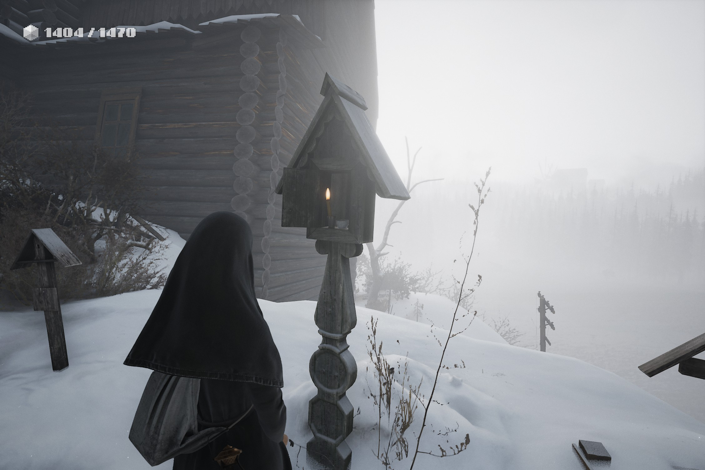
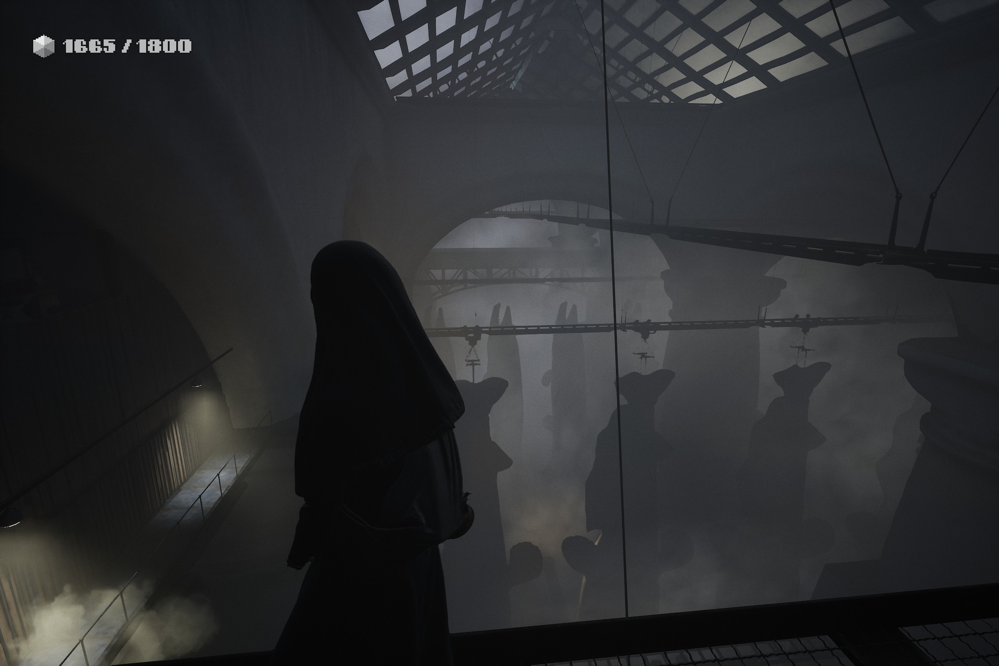

I recently played through [*Indika*, by Odd Meter Games](https://indikathegame.com/). From their site:

> "INDIKA tells the story of a young nun who sets off on a journey of self-discovery with the most unusual companion by her side, the devil himself." 

It was definitely one of the more thought-provoking games I have experienced, and if there is such a thing as "video games as art", *Indika* could be used as a good example. Just like modern art is not for everyone, I can see *Indika* not being for everyone either. Dark, gritty, and heavy with themes of religion and morality, it does not offer a passive play-through. As [RockPaperShotgun notes](https://www.rockpapershotgun.com/how-historical-fantasy-indika-channels-its-russian-creators-anger-against-putin-and-the-orthodox-church), *Indika* is the creators' (who left the country to finish the game) response to Putin and the Russian Orthodox Church.

The story is done well, though the ending was slightly anti-climactic, but in this regard rather reminiscent of the small bit of Russian literature I have read. The puzzles were engaging, and I for one enjoyed the "retro" minigames which framed the backstory. That being said, several mechanics felt criminally underused, and at only about 5 hours long, I feel some aspects in both the story and game-play could have been explored further. A final point of praise is in order for the visual design and setting, some scenes were quite unsettling. 

Recommend if: You enjoy exploring heavy themes, commentary on religion, and stark, uncomfortable settings.

Wouldn't recommend if: You are put off by any of the above, or are dead-set on historical accuracy/realism.

{ width=100% }\

{ width=100% }\
